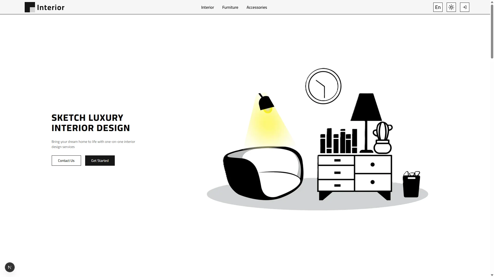

# Interior Design Hub

A high-end, full-stack Interior Design platform built with a focus on modern aesthetics and extreme performance. This project leverages the latest capabilities of Next.js 16 and React 19 to deliver a seamless, multi-language experience.

## 👨‍💻 Technical Stack

This project is built using a "bleeding-edge" tech stack:

- **Core Framework:** Next.js 16.1.6 (App Router) with Turbopack for ultra-fast development cycles.

- **UI Library:** React 19.2.4 utilizing the newest rendering patterns.

- **Styling:** Tailwind CSS 4.1.12 for a utility-first, modern design system.

- **Animations:** Built with Motion (Framer Motion) for fluid, interactive transitions.

- **Database:** Mongoose for robust MongoDB data modeling.

- **Internationalization:** next-international for localized routing (Arabic & English).

- **Authentication:** Next-Auth v5 (Beta) with secure session management.

- **Components:** Powered by Radix UI primitives for accessibility and customization.

## 📂 Project Structure

The repository follows a strictly organized architecture:

- **app/[locale]:** Root of the application with dynamic localization support.

- **actions:** Centralized Server Actions for secure database mutations.

- **components:** Modularized into auth, client, server, and ui for reusability.

- **locales:** Dictionary management for multi-language support (AR/EN).

- **models:** TypeScript-defined schemas for Admin, Client, Interior, and User.

- **enums:** Type-safe constants for colors, projects, and design styles.

- **functions:** Utility logic for authentication and image processing.

## 🗝️ Key Features

- **Bilingual Support:** Full RTL/LTR support for Arabic and English users.

- **Optimized Performance:** Leveraging Next.js 16 server components and Turbopack.

- **Advanced Image Handling:** Integrated with uploadthing for professional media management.

- **Modern UX:** Features Dark/Light mode, responsive layouts, and accessible UI components.
